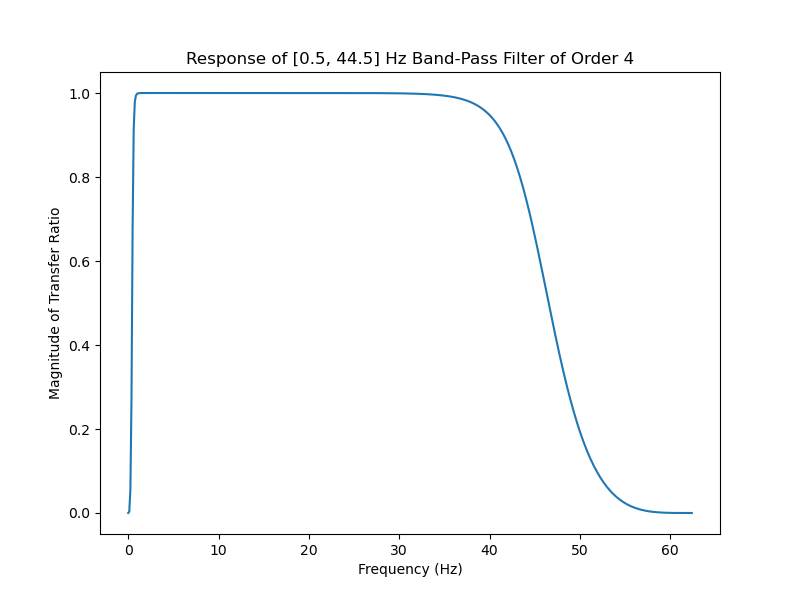
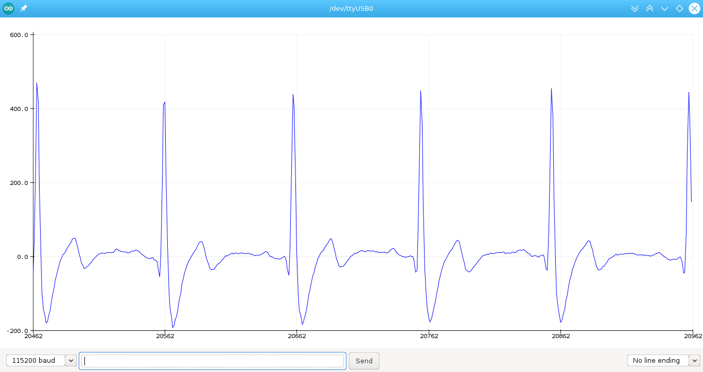

# Heart-BioAmp-Firmware
Firmware for Heart BioAmp hardware from Upside Down Labs

| No. | Program | Description |
| ---- | ------- | --------- |
|1 | [Fixed_Sampling](01_Fixed_Sampling)| Sample from ADC at a fixed rate for easy processing of signal.|
|2 | [ECG_Filter](02_ECG_Filter)| A 0.5 - 44.5 Hz band-pass filter sketch for clean Electrocardiography.|
|3 | [Heart_Rate_Detection](03_Heart_Rate_Detection)| ECG signal based BPM (beats per minute) calculator.|
|4 | [Heart_Beat_Detection](04_Heart_Beat_Detection)| Standard deviation based heart beat detection algorithm.|
|5 | [BLE_Heart_Rate_Detection](05_BLE_Heart_Rate_Detection)| ECG based Heart Rate calculator with ESP32 BLE.|
|6 | [Faster_Heart_Rate_Detection](06_Faster_Heart_Rate_Detection)| More optimized and faster calculation of BPM.|
|7 | [OLED_BPM](07_OLED_BPM)| Displaying Heart Rate(BPM) on OLED Screen|
|8 | [Breathing_Monitor](08_Breathing_Monitor)| Displaying Heart Rate(BPM) on OLED Screen|

Compatibility of various boards with Brain-BioAmp sensors
<table>
    <thead>
        <tr>
            <th>No.</th>
            <th>Development Board</th>
             <th>Maximum ADC Resolution</th>
            <th>Sensor</th>
            <th>Compatibility</th>
        </tr>
    </thead>
    <tbody>
        <tr>
            <td >1</td>
            <td align= "center" >Arduino UNO R3 & Maker UNO</td>
            <td align = "center" >10 bits</td>
            <td>Bioamp EXG Pill</td>
            <td align = "center">✅</td>
        </tr>
        <tr>
            <td >2</td>
            <td align = "center" >Arduino UNO R4 Minima & Arduino UNO R4 Wifi</td>
            <td align = "center">14 bits</td>
            <td>Bioamp EXG Pill</td>
            <td align= "center">✅</td>
        </tr>
        <tr>
            <td >3</td>
            <td align = "center" >Raspberry Pi Pico</td>
            <td align = "center" >12 bits</td>
            <td>Bioamp EXG Pill</td>
            <td align = "center">❌</td>
        </tr>
       <tr>
             <td >4</td>
            <td align= "center"  >ESP32 C3 MINI</td>
           <td align = "center" >12 bits</td>
            <td align = "center">Bioamp EXG Pill</td>
            <td align= "center">❌</td>
        </tr>
        <tr>
             <td >5</td>
            <td align= "center"  >Arduino Due</td>
           <td align = "center" >12 bits</td>
            <td>Bioamp EXG Pill</td>
            <td align = "center">✅</td>
        </tr>
        <tr>
             <td>6</td>
            <td align= "center"  >Arduino Nano</td>
           <td align = "center" >10 bits</td>
            <td>Bioamp EXG Pill</td>
            <td align = "center">✅</td>
        </tr>
        </tbody>
    </table>

## Examples

1. **ECG Filter**

    A band-pass filter for EMG signals between 0.5 Hz and 44.5 Hz

    
    

2. **ECG Wave**

    EMG signal detection for biomedical applications.

    
